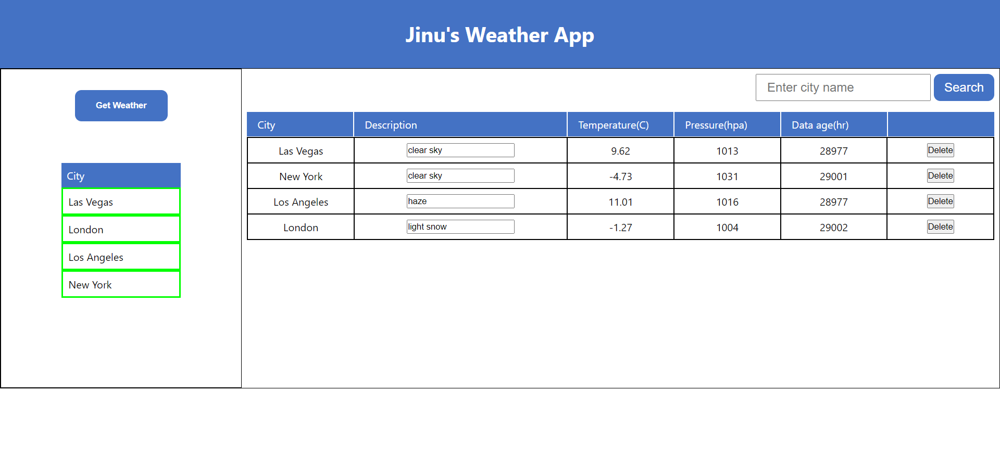

# Weather App

## Description

This ReactJS web app displays weather details of different cities and allows users to search for the weather details of a particular city.

[View Demo](https://serene-peony-439364.netlify.app/);

## Functionality

The app includes the following functionalities:

## Get Weather

- Clicking the "Get Weather" button fetches weather data for each city in the "City list" table.
- The app highlights the current city being processed.
- Weather data is fetched from the API and displayed in the "Details" table.

## Edit Description

- The Description field in the "Details" table is editable by the user.
- Users can modify the description for each city's weather data.

## Delete Row

- Clicking the Delete button removes the corresponding row from the "Details" table.
- The table data is updated accordingly in the dictionary/JS object.

## Search

- Users can enter a city name in the search input box.
- Clicking the Search button highlights the corresponding row in the "Details" table (if present) in yellow color for 3 seconds.

## Pages

### Home Page



## Installation

To run the app, clone the repository and install the required dependencies using npm:

```bash
git clone https://github.com/Jinu-Vijayan/weather_app.git
cd weather_app
npm install
```

## Running the App

Run the app using npm:

```bash
npm start
```

The app will be available at `http://localhost:3000` in your browser.